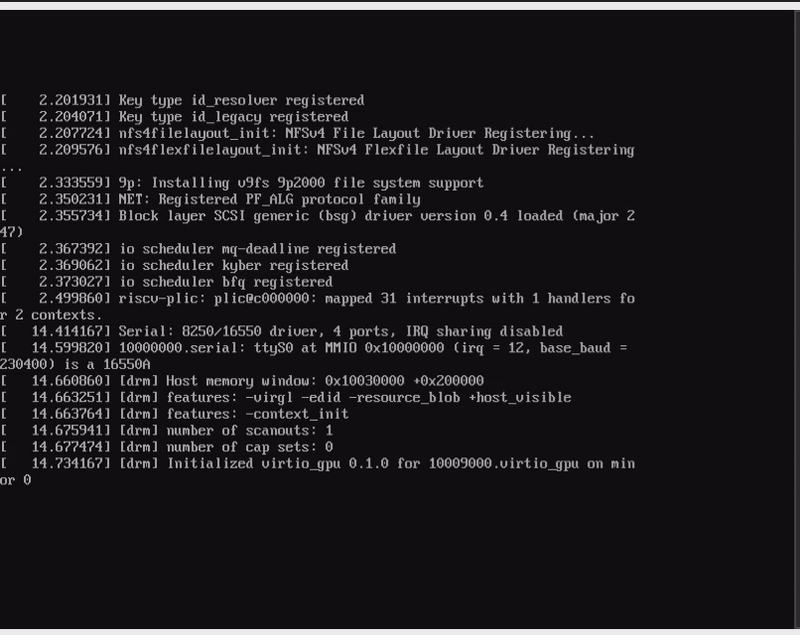

# tiny-rv32ima-sim
rv32imaのriscvシミュレータ



## Goals
- [X] OpenSBIのブート
- [X] Linuxカーネルをブート
- [X] Busyboxのシェルで遊べる

## Usage
1. OpenSBIをrv32ima向けにビルド
2. Linuxカーネル(5.14)、Busyboxをrv32ima_zicntr_zicsr_zifencei_svaduをサポートするようにビルド
3. デバイスツリーソース(platform.dts)をビルドしdtbに変換
4. src/main.rsの内容を適切に変更
6. 以下を実行
```bash
$ wasm-pack build --target web
$ python3 -m http.server  -b 127.0.0.1
```
7. ブラウザにて`http://localhost:8000/wasm/index.html`にアクセス

